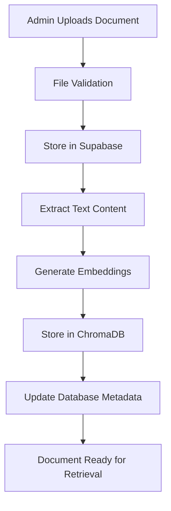
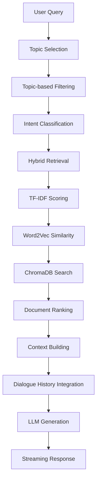

# ADDU Admissions Chatbot - Comprehensive System Flow Documentation

## Table of Contents

1. [System Overview](#system-overview)
2. [Architecture Components](#architecture-components)
3. [Data Flow](#data-flow)
4. [NLP Components](#nlp-components)
5. [LLM Integration](#llm-integration)
6. [Admin System](#admin-system)
7. [Frontend Components](#frontend-components)
8. [Code Examples](#code-examples)
9. [Database Schema](#database-schema)
10. [API Endpoints](#api-endpoints)

## System Overview

The ADDU Admissions Chatbot is a sophisticated hybrid retrieval-augmented generation (RAG) system that combines multiple NLP techniques with a cloud-based LLM to provide accurate, context-aware responses about university admissions, programs, and fees.

### Key Features

- **Guided Conversation Flow**: Topic-based conversation management with structured interactions
- **Hybrid Retrieval**: TF-IDF + Word2Vec + ChromaDB semantic search
- **Intent Classification**: Semantic similarity-based query classification
- **Admin Document Management**: Full CRUD operations for documents and folders
- **Real-time Streaming**: Together AI integration with streaming responses
- **Multi-modal Data**: Supports PDF, Excel, CSV, and text documents

## Architecture Components

```
┌─────────────────────────────────────────────────────────────────────┐
│                         USER INTERFACE                               │
│                       (React Frontend)                               │
│                                                                       │
│                     ┌──────────────────┐                            │
│                     │  Guided Chat     │                            │
│                     │  Interface       │                            │
│                     │                  │                            │
│                     │ + Topic Selection│                            │
│                     │ + Conversation   │                            │
│                     │ + History View   │                            │
│                     └──────────────────┘                            │
│                              │                                       │
└──────────────────────────────┼───────────────────────────────────────┘
                               │
                               │ HTTP POST
                               │ /chatbot/chat/guided/
                               ▼
┌─────────────────────────────────────────────────────────────────────┐
│                      DJANGO BACKEND                                  │
│                                                                       │
│                    ┌─────────────────────────────┐                  │
│                    │  Guided Conversation        │                  │
│                    │  System                     │                  │
│                    │                             │                  │
│                    │ + Topic Selection           │                  │
│                    │ + Intent Classification     │                  │
│                    │ + Document Filtering        │                  │
│                    │ + Context Management        │                  │
│                    │ + Dialogue History          │                  │
│                    │                             │                  │
│                    │ + TF-IDF Retrieval          │                  │
│                    │ + Word2Vec Vectors          │                  │
│                    │ + ChromaDB Search           │                  │
│                    └─────────────────────────────┘                  │
│                                 │                                    │
└─────────────────────────────────┼────────────────────────────────────┘
                                  │
                                  ▼
                    ┌───────────────────────┐
                    │  TOGETHER AI LLM      │
                    │  (Cloud Service)      │
                    │                       │
                    │  Llama-4-Scout-17B    │
                    │  Streaming Response   │
                    │  Temperature: 0.3     │
                    └───────────────────────┘
```

## Data Flow

### 1. Document Upload and Processing Flow



**Code Implementation:**

```python
# Document Upload Handler (views.py)
@csrf_exempt
def admin_upload_view(request):
    if request.method == "POST":
        file = request.FILES.get('file')
        folder_id = request.POST.get('folder_id')
        document_type = request.POST.get('document_type', 'other')
        keywords = request.POST.get('keywords', '')

        try:
            # 1. Upload to Supabase
            supabase = get_supabase_client()
            file_bytes = file.read()

            upload_result = supabase.storage.from_("documents").upload(
                f"uploads/{file.name}",
                file_bytes,
                file_options={"content-type": file.content_type}
            )

            # 2. Create database record
            folder = DocumentFolder.objects.get(id=folder_id)
            doc_metadata = DocumentMetadata.objects.create(
                filename=file.name,
                folder=folder,
                document_type=document_type,
                keywords=keywords,
                file_size=len(file_bytes),
                supabase_path=upload_result.path
            )

            # 3. Process and embed document
            sync_supabase_to_chroma_improved()

            return JsonResponse({
                "message": f"Document '{file.name}' uploaded successfully",
                "document_id": doc_metadata.id
            })

        except Exception as e:
            return JsonResponse({"error": str(e)}, status=500)
```

### 2. Query Processing Flow



## NLP Components

### 1. TF-IDF (Term Frequency-Inverse Document Frequency)

**Purpose**: Keyword-based document retrieval and scoring
**Implementation**: Uses scikit-learn's TfidfVectorizer

```python
# TF-IDF Implementation (fast_hybrid_chatbot_together.py)
def _load_tfidf_vectorizer(self):
    """Load or create TF-IDF vectorizer"""
    tfidf_path = os.path.join(self.embeddings_dir, "tfidf_vectorizer.pkl")

    if os.path.exists(tfidf_path):
        with open(tfidf_path, 'rb') as f:
            self.tfidf_vectorizer = pickle.load(f)
        print(f"✅ Loaded TF-IDF vectorizer from {tfidf_path}")
    else:
        # Create new vectorizer
        self.tfidf_vectorizer = TfidfVectorizer(
            max_features=10000,
            stop_words='english',
            ngram_range=(1, 2),
            min_df=2,
            max_df=0.8
        )
        print("⚠️ Created new TF-IDF vectorizer")

def _calculate_tfidf_similarity(self, query: str, documents: List[str]) -> np.ndarray:
    """Calculate TF-IDF similarity scores"""
    if not self.tfidf_vectorizer:
        return np.zeros(len(documents))

    try:
        # Transform query and documents
        query_vector = self.tfidf_vectorizer.transform([query])
        doc_vectors = self.tfidf_vectorizer.transform(documents)

        # Calculate cosine similarity
        similarities = cosine_similarity(query_vector, doc_vectors).flatten()
        return similarities

    except Exception as e:
        print(f"⚠️ TF-IDF similarity calculation failed: {e}")
        return np.zeros(len(documents))
```

### 2. Word2Vec Semantic Vectors

**Purpose**: Semantic similarity and context understanding
**Model**: Google News pre-trained vectors (300 dimensions)

```python
# Word2Vec Implementation
def compute_word2vec_vector(tokens, model=None, dim=300):
    """Compute Word2Vec vector for tokens"""
    if not tokens:
        return np.zeros(dim)

    if model is not None:
        vectors = []
        for token in tokens:
            try:
                if token in model:
                    vectors.append(model[token])
            except:
                pass

        if vectors:
            return np.mean(vectors, axis=0)  # Average word vectors

    return np.zeros(dim)

def _calculate_word2vec_similarity(self, query: str, documents: List[str]) -> np.ndarray:
    """Calculate Word2Vec semantic similarity"""
    if not self.word2vec_model:
        return np.zeros(len(documents))

    # Preprocess query
    query_tokens = preprocess_text(query)
    query_vector = compute_word2vec_vector(query_tokens, self.word2vec_model)

    similarities = []
    for doc in documents:
        doc_tokens = preprocess_text(doc)
        doc_vector = compute_word2vec_vector(doc_tokens, self.word2vec_model)

        # Calculate cosine similarity
        similarity = cosine_similarity([query_vector], [doc_vector])[0][0]
        similarities.append(similarity)

    return np.array(similarities)
```

### 3. Hybrid Retrieval System

**Purpose**: Combines TF-IDF, Word2Vec, and ChromaDB for optimal document retrieval

```python
def retrieve_documents_by_topic_hybrid(self, query: str, topic_id: str, top_k: int = 2) -> List[Dict]:
    """
    HYBRID TOPIC + SEMANTIC RETRIEVAL:
    1. Filter documents by topic keywords
    2. Generate TF-IDF + Word2Vec vectors for query and filtered documents
    3. Calculate semantic similarity using cosine similarity
    4. Combine topic relevance (60%) + semantic similarity (40%)
    """
    print(f"🔬 Hybrid topic + semantic retrieval for: '{query}' (topic: {topic_id})")

    # Normalize query
    normalized_query = self._normalize_program_acronyms(query)
    normalized_query = self._normalize_school_abbreviations(normalized_query)

    try:
        collection = ChromaService.get_client().get_or_create_collection(name=self.chroma_collection_name)

        # Get topic keywords for filtering
        topic_keywords = get_topic_keywords(topic_id)
        if not topic_keywords:
            print(f"⚠️ No keywords found for topic '{topic_id}', using generic retrieval")
            return self.retrieve_documents_by_topic_keywords_simple(query, topic_id, top_k)

        # Build keyword filter for ChromaDB
        keyword_conditions = []
        for keyword in topic_keywords:
            keyword_conditions.append({"keywords": {"$regex": f".*\\b{keyword}\\b.*"}})

        where_clause = {
            "$and": [
                {"source": "pdf_scrape"},
                {"$or": keyword_conditions}
            ]
        }

        # Get filtered documents
        all_docs = collection.get(
            where=where_clause,
            include=["documents", "metadatas"]
        )

        all_ids = all_docs.get('ids', [])
        all_contents = all_docs.get('documents', [])
        all_metadatas = all_docs.get('metadatas', [])

        if not all_contents:
            print(f"⚠️ No documents found for topic '{topic_id}'")
            return []

        print(f"📚 Found {len(all_contents)} topic-filtered documents")

        # Calculate hybrid scores
        tfidf_scores = self._calculate_tfidf_similarity(normalized_query, all_contents)
        word2vec_scores = self._calculate_word2vec_similarity(normalized_query, all_contents)

        # Combine scores: 60% TF-IDF + 40% Word2Vec
        hybrid_scores = 0.6 * tfidf_scores + 0.4 * word2vec_scores

        # Create scored results
        scored_results = []
        for i, (doc_id, content, metadata) in enumerate(zip(all_ids, all_contents, all_metadatas)):
            scored_results.append({
                'id': doc_id,
                'content': content,
                'metadata': metadata,
                'relevance': float(hybrid_scores[i]),
                'tfidf_score': float(tfidf_scores[i]),
                'word2vec_score': float(word2vec_scores[i])
            })

        # Sort by hybrid score and return top_k
        scored_results.sort(key=lambda x: x['relevance'], reverse=True)
        return scored_results[:top_k]

    except Exception as e:
        print(f"❌ Hybrid retrieval error: {e}")
        return self.retrieve_documents_by_topic_keywords_simple(query, topic_id, top_k)
```

## LLM Integration

### Together AI Configuration

**Model**: Llama-4-Scout-17B-16E-Instruct
**Purpose**: Response generation with reduced hallucinations

```python
# Together AI Configuration (together_ai_interface.py)
TOGETHER_CONFIG = {
    "model": "meta-llama/Llama-4-Scout-17B-16E-Instruct",
    "max_tokens": 1024,
    "temperature": 0.3,        # Lower temperature to reduce hallucinations
    "top_p": 0.8,             # More focused sampling
    "top_k": 25,              # Reduced for more deterministic output
    "repetition_penalty": 1.15,
    "stop": ["</answer>", "<|user|>", "<|system|>", "<|assistant|>"]
}

def generate_response(prompt: str, max_tokens: int = 1024) -> str:
    """Generate a non-streaming response"""
    messages = [{"role": "user", "content": prompt}]

    try:
        response = client.chat.completions.create(
            model=TOGETHER_CONFIG["model"],
            messages=messages,
            max_tokens=max_tokens,
            temperature=TOGETHER_CONFIG["temperature"],
            top_p=TOGETHER_CONFIG["top_p"],
            top_k=TOGETHER_CONFIG["top_k"],
            repetition_penalty=TOGETHER_CONFIG["repetition_penalty"],
            stop=TOGETHER_CONFIG["stop"]
        )

        return response.choices[0].message.content

    except Exception as e:
        print(f"[ERROR] Together AI generation error: {e}")
        return ""
```

### Guided Chat Response Generation Flow

```python
def _process_topic_query(self, query: str, topic_id: str) -> Dict:
    """Process query within guided conversation context"""

    # 1. Topic-based Document Retrieval
    start_time = time.time()
    relevant_docs = self.retrieve_documents_by_topic_hybrid(query, topic_id, top_k=3)
    retrieval_time = time.time() - start_time

    # 2. Context Building
    doc_context = "\n\n".join([
        f"Source: {doc.get('id','')}\n{doc['content']}"
        for doc in relevant_docs[:3]
    ])

    # 3. Dialogue History Integration
    history_context = ""
    if self.dialogue_history:
        base_prompt_estimate = f"System instructions + Context: {doc_context} + Query: {query}"
        base_tokens = len(base_prompt_estimate.split())
        available_for_history = 3500 - base_tokens

        history_context = self.build_smart_history_context(query, available_for_history)
        print(f"📜 Built history context: {len(history_context)} chars")

    # 4. Guided Prompt Construction
    prompt = f"""<|system|>
You are an ADDU admissions assistant. Answer questions using ONLY the provided context.

RULES:
- Be direct and concise
- Use simple formatting
- No introductory phrases like "Based on the provided documentation"
- No closing phrases like "I hope this helps"
- Start directly with the answer
- Use numbered lists for steps
- Use bullet points for items
- Bold important terms only when necessary
</|system|>

<|context|>
{doc_context}
</|context|>

{history_context}

<|user|>
{query}
</|user|>

<|assistant|>
"""

    # 5. LLM Generation with Streaming
    response = stream_response(prompt, max_tokens=1024)

    # 6. Update Dialogue History
    self.add_to_history(query, response)

    return {
        'response': response,
        'sources': relevant_docs,
        'retrieval_time': retrieval_time,
        'topic_id': topic_id
    }
```

## Admin System

### Document Management Architecture

The admin system provides comprehensive document management with hierarchical folder structure and metadata management.

```python
# Admin Models (models.py)
class DocumentFolder(models.Model):
    """Hierarchical folder structure for document organization"""
    name = models.CharField(max_length=255)
    description = models.TextField(blank=True)
    color = models.CharField(max_length=7, default='#063970')  # Hex color
    parent_folder = models.ForeignKey('self', on_delete=models.CASCADE, null=True, blank=True)
    created_at = models.DateTimeField(auto_now_add=True)
    updated_at = models.DateTimeField(auto_now=True)

    @property
    def folder_path(self):
        """Get full folder path (e.g., 'Parent / Child / Grandchild')"""
        if self.parent_folder:
            return f"{self.parent_folder.folder_path} / {self.name}"
        return self.name

class DocumentMetadata(models.Model):
    """Document metadata and storage information"""
    DOCUMENT_TYPE_CHOICES = [
        ('admission', 'Admission Requirements'),
        ('enrollment', 'Enrollment Process'),
        ('scholarship', 'Scholarships & Financial Aid'),
        ('academic', 'Academic Programs'),
        ('fees', 'Fees & Payments'),
        ('policy', 'Policies & Procedures'),
        ('contact', 'Contact Information'),
        ('other', 'Other'),
    ]

    filename = models.CharField(max_length=255)
    folder = models.ForeignKey(DocumentFolder, on_delete=models.CASCADE)
    document_type = models.CharField(max_length=20, choices=DOCUMENT_TYPE_CHOICES)
    keywords = models.TextField(help_text="Comma-separated keywords")
    file_size = models.IntegerField()
    supabase_path = models.CharField(max_length=500)
    synced_to_chroma = models.BooleanField(default=False)
    created_at = models.DateTimeField(auto_now_add=True)
    updated_at = models.DateTimeField(auto_now=True)
```

### File Upload and Processing

```python
# Admin Upload View (views.py)
@csrf_exempt
def admin_upload_view(request):
    """Handle document upload with metadata"""
    if request.method == "POST":
        try:
            file = request.FILES.get('file')
            folder_id = request.POST.get('folder_id')
            document_type = request.POST.get('document_type', 'other')
            keywords = request.POST.get('keywords', '')

            # Validate file type
            allowed_extensions = ['.pdf', '.txt', '.doc', '.docx', '.csv', '.xlsx', '.xls']
            file_ext = os.path.splitext(file.name)[1].lower()

            if file_ext not in allowed_extensions:
                return JsonResponse({
                    "error": f"Unsupported file type: {file_ext}"
                }, status=400)

            # Upload to Supabase
            supabase = get_supabase_client()
            file_bytes = file.read()

            upload_result = supabase.storage.from_("documents").upload(
                f"uploads/{file.name}",
                file_bytes,
                file_options={"content-type": file.content_type}
            )

            # Create database record
            folder = DocumentFolder.objects.get(id=folder_id)
            doc_metadata = DocumentMetadata.objects.create(
                filename=file.name,
                folder=folder,
                document_type=document_type,
                keywords=keywords,
                file_size=len(file_bytes),
                supabase_path=upload_result.path
            )

            # Sync to ChromaDB
            sync_result = sync_supabase_to_chroma_improved()

            return JsonResponse({
                "message": f"Document '{file.name}' uploaded and processed successfully",
                "document_id": doc_metadata.id,
                "sync_status": sync_result
            })

        except Exception as e:
            return JsonResponse({"error": str(e)}, status=500)
```

### ChromaDB Synchronization

```python
# Document Processing (improved_pdf_to_chroma.py)
def sync_supabase_to_chroma_improved():
    """Sync documents from Supabase to ChromaDB with improved processing"""

    try:
        # Initialize services
        supabase = get_supabase_client()
        chroma_service = ChromaService()
        collection = chroma_service.get_client().get_or_create_collection(name="documents")

        # Get unsynced documents
        unsynced_docs = DocumentMetadata.objects.filter(synced_to_chroma=False)

        for doc in unsynced_docs:
            try:
                # Download from Supabase
                file_data = supabase.storage.from_("documents").download(doc.supabase_path)

                # Extract text based on file type
                if doc.filename.lower().endswith('.pdf'):
                    text_content = extract_text_from_pdf(file_data)
                elif doc.filename.lower().endswith(('.xlsx', '.xls', '.csv')):
                    text_content = extract_text_from_excel_csv(file_data, doc.filename)
                else:
                    text_content = file_data.decode('utf-8', errors='ignore')

                # Generate embeddings
                embedding = embed_text(text_content)

                # Prepare metadata
                metadata = {
                    'filename': doc.filename,
                    'folder_name': doc.folder.name,
                    'folder_path': doc.folder.folder_path,
                    'document_type': doc.document_type,
                    'keywords': doc.keywords,
                    'file_size': doc.file_size,
                    'source': 'pdf_scrape',
                    'created_at': doc.created_at.isoformat()
                }

                # Add to ChromaDB
                collection.add(
                    embeddings=[embedding],
                    documents=[text_content],
                    metadatas=[metadata],
                    ids=[f"doc_{doc.id}"]
                )

                # Mark as synced
                doc.synced_to_chroma = True
                doc.save()

                print(f"✅ Synced document: {doc.filename}")

            except Exception as e:
                print(f"❌ Failed to sync {doc.filename}: {e}")
                continue

        return {"status": "success", "synced_count": len(unsynced_docs)}

    except Exception as e:
        print(f"❌ Sync process failed: {e}")
        return {"status": "error", "message": str(e)}
```

## Frontend Components

### Guided Chat Interface

```jsx
// GuidedChatPage.jsx - Main guided chat component
const GuidedChatPage = () => {
  const [messages, setMessages] = useState([]);
  const [conversationState, setConversationState] = useState("topic_selection");
  const [currentTopic, setCurrentTopic] = useState(null);
  const [sessionId, setSessionId] = useState(null);

  const sendMessage = async (
    userInput,
    actionType = "message",
    actionData = null
  ) => {
    try {
      const response = await fetch(
        "http://localhost:8000/chatbot/chat/guided/",
        {
          method: "POST",
          headers: { "Content-Type": "application/json" },
          body: JSON.stringify({
            user_input: userInput,
            action_type: actionType,
            action_data: actionData,
            session_id: sessionId,
          }),
        }
      );

      const data = await response.json();

      // Update conversation state
      setConversationState(data.conversation_state);
      setCurrentTopic(data.current_topic);
      setSessionId(data.session_id);

      // Add messages
      if (data.response) {
        setMessages((prev) => [
          ...prev,
          {
            type: "bot",
            content: data.response,
            timestamp: new Date(),
            buttons: data.buttons || [],
          },
        ]);
      }
    } catch (error) {
      console.error("Error sending message:", error);
    }
  };

  const handleTopicSelection = (topicId) => {
    sendMessage("", "topic_selection", { topic_id: topicId });
  };

  return (
    <div className="chat-container">
      <div className="messages">
        {messages.map((message, index) => (
          <MessageComponent
            key={index}
            message={message}
            onButtonClick={handleTopicSelection}
          />
        ))}
      </div>

      <div className="input-area">
        {conversationState === "topic_conversation" && (
          <TextInput onSend={(text) => sendMessage(text)} />
        )}
      </div>
    </div>
  );
};
```

### Admin Dashboard

```jsx
// AdminPage.jsx - Document management interface
const AdminPage = () => {
  const [documents, setDocuments] = useState([]);
  const [folders, setFolders] = useState([]);
  const [stagedFile, setStagedFile] = useState(null);
  const [uploadMetadata, setUploadMetadata] = useState({
    folder_id: "",
    document_type: "other",
    keywords: "",
  });

  const handleFinalUpload = async () => {
    if (!stagedFile || !uploadMetadata.folder_id) return;

    const formData = new FormData();
    formData.append("file", stagedFile);
    formData.append("folder_id", uploadMetadata.folder_id);
    formData.append("document_type", uploadMetadata.document_type);
    formData.append("keywords", uploadMetadata.keywords);

    try {
      const response = await fetch(
        "http://localhost:8000/chatbot/admin/upload/",
        {
          method: "POST",
          body: formData,
        }
      );

      const result = await response.json();

      if (response.ok) {
        alert(result.message);
        fetchAllData(); // Refresh data
        handleClearStagedFile();
      } else {
        alert(`Upload failed: ${result.error}`);
      }
    } catch (error) {
      console.error("Upload error:", error);
      alert("Upload failed. Please try again.");
    }
  };

  return (
    <div className="admin-dashboard">
      <div className="upload-section">
        <FileDropZone onFileStaged={setStagedFile} />
        {stagedFile && (
          <MetadataForm
            metadata={uploadMetadata}
            onChange={setUploadMetadata}
            onSubmit={handleFinalUpload}
          />
        )}
      </div>

      <div className="management-section">
        <FolderManager folders={folders} />
        <DocumentTable documents={documents} />
      </div>
    </div>
  );
};
```

## Database Schema

### Core Tables

```sql
-- Topics for guided conversation
CREATE TABLE chatbot_topic (
    id SERIAL PRIMARY KEY,
    topic_id VARCHAR(50) UNIQUE NOT NULL,
    label VARCHAR(255) NOT NULL,
    description TEXT NOT NULL,
    retrieval_strategy VARCHAR(50) DEFAULT 'generic',
    is_active BOOLEAN DEFAULT TRUE,
    created_at TIMESTAMP DEFAULT NOW(),
    updated_at TIMESTAMP DEFAULT NOW()
);

-- Topic keywords for document filtering
CREATE TABLE chatbot_topickeyword (
    id SERIAL PRIMARY KEY,
    topic_id INTEGER REFERENCES chatbot_topic(id) ON DELETE CASCADE,
    keyword VARCHAR(255) NOT NULL,
    is_active BOOLEAN DEFAULT TRUE,
    created_at TIMESTAMP DEFAULT NOW(),
    created_by VARCHAR(255),
    UNIQUE(topic_id, keyword)
);

-- Document folders (hierarchical)
CREATE TABLE chatbot_documentfolder (
    id SERIAL PRIMARY KEY,
    name VARCHAR(255) NOT NULL,
    description TEXT,
    color VARCHAR(7) DEFAULT '#063970',
    parent_folder_id INTEGER REFERENCES chatbot_documentfolder(id) ON DELETE CASCADE,
    created_at TIMESTAMP DEFAULT NOW(),
    updated_at TIMESTAMP DEFAULT NOW()
);

-- Document metadata
CREATE TABLE chatbot_documentmetadata (
    id SERIAL PRIMARY KEY,
    filename VARCHAR(255) NOT NULL,
    folder_id INTEGER REFERENCES chatbot_documentfolder(id) ON DELETE CASCADE,
    document_type VARCHAR(20) NOT NULL,
    keywords TEXT,
    file_size INTEGER NOT NULL,
    supabase_path VARCHAR(500) NOT NULL,
    synced_to_chroma BOOLEAN DEFAULT FALSE,
    created_at TIMESTAMP DEFAULT NOW(),
    updated_at TIMESTAMP DEFAULT NOW()
);
```

## API Endpoints

### Chat Endpoints

```python
# Guided Chat
POST /chatbot/chat/guided/
{
    "user_input": "Tell me about BS IT fees",
    "action_type": "message",
    "action_data": null,
    "session_id": "uuid-string"
}

# Topic Selection
POST /chatbot/chat/guided/
{
    "user_input": "",
    "action_type": "topic_selection",
    "action_data": {"topic_id": "programs_courses"},
    "session_id": "uuid-string"
}

# Get Topics
GET /chatbot/topics/
Response: {
    "topics": [
        {
            "id": "admissions_enrollment",
            "label": "Admissions & Enrollment",
            "description": "Learn about admissions and enrollment",
            "keywords": ["admission", "requirements", "application"]
        },
        {
            "id": "programs_courses",
            "label": "Programs & Courses",
            "description": "Information about academic programs and curriculum",
            "keywords": ["program", "course", "curriculum", "degree"]
        },
        {
            "id": "fees_payments",
            "label": "Fees & Payments",
            "description": "Tuition fees and payment information",
            "keywords": ["fees", "tuition", "payment", "cost"]
        }
    ]
}
```

### Admin Endpoints

```python
# Upload Document
POST /chatbot/admin/upload/
Content-Type: multipart/form-data
- file: [binary file data]
- folder_id: integer
- document_type: string
- keywords: string

# Manage Folders
GET /chatbot/admin/folders/
POST /chatbot/admin/folders/
PUT /chatbot/admin/folders/{id}/
DELETE /chatbot/admin/folders/{id}/

# Manage Documents
GET /chatbot/admin/documents/
PUT /chatbot/admin/documents/{id}/metadata/
DELETE /chatbot/admin/documents/{id}/
GET /chatbot/admin/download/{filename}/
```

## Key Features Summary

### 1. **Hybrid NLP Architecture**

- **TF-IDF**: Keyword-based retrieval for exact matches
- **Word2Vec**: Semantic similarity for context understanding
- **ChromaDB**: Vector database for efficient similarity search

### 2. **Intent Classification**

- Semantic similarity-based classification
- Program-specific vs. policy query detection
- Student type detection (new, transfer, international)

### 3. **Guided Conversation Flow**

- Topic-based conversation management with structured interactions
- Context-aware document filtering by topic
- Session state management with dialogue history tracking
- Multi-turn conversation continuity

### 4. **Advanced Document Processing**

- Multi-format support (PDF, Excel, CSV, Word)
- Hierarchical folder organization
- Metadata-driven retrieval

### 5. **Cloud-Based LLM Integration**

- Together AI Llama-4-Scout model
- Streaming responses for real-time interaction
- Optimized prompts for reduced hallucinations

### 6. **Comprehensive Admin System**

- Drag-and-drop file uploads
- Real-time document synchronization
- Folder hierarchy management
- Document metadata editing

This guided conversation system provides a robust, scalable solution for university admissions support with advanced NLP capabilities, dialogue history tracking, and comprehensive document management through structured topic-based interactions.
